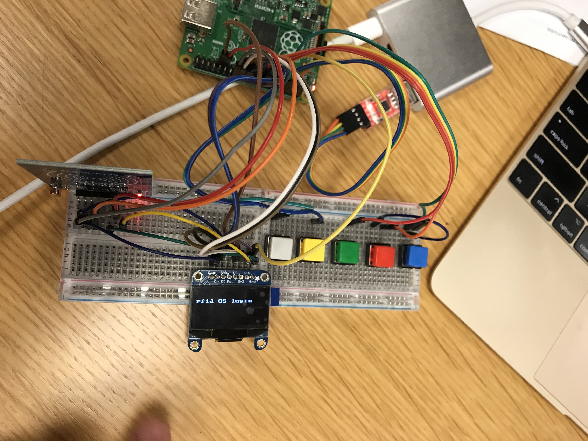

# Final Project Writeup
### *Nadin El-Yabroudi and Noah Shutty*

## [Demo Video](https://youtu.be/aK1hxhdEgCs)



## Introduction
Our project consisted of three parts: setting up an RFID card reader that interfaced with an OLED screen, creating preemptive threads, and implementing a few basic/fun demo applications for the resulting device. The purpose of the RFID card reader was to support two-factor authentication that would grant users permissions to run programs. The preemptive threads were intended to make the system design simpler. For instance, the OLED display would be controlled by one thread that read from a fixed region of volatile memory, and the various programs (including RFID authentication) would be peer threads. Two factor authentication is a modern approach to system security where multiple factors (e.g., a password and a Yubikey) are combined. Since requiring hardware 2FA for its employees in 2017, Google has detected zero instances of corporate credential theft [1].

## How to Run & System Functionality

### RFID & OLED Screen
To run the RFID & OLED Screen system follow these steps:
1. Setup the RFID, OLED, and four buttons as described in the hardware setup section.
2. Go to the project directory: `cd lab8-sonar/sonar-hc-sr04`
3. Make the binary: `make`
4. Run the program `my-install sonar.bin`
5. You should see 'LOGIN PASSWORD:' showing on the screen. The password is '3124'.
6. Do two factor authentication by scanning an RFID token on the RFID reader. You should see the Welcome screen.
7. Press button 0 to enter the program environment and thereafter to context switch between tasks.
8. See the demo video for more details on how to use the demo programs.

### Preemptive Threads
NOTE: We did not achieve fully functioning preemptive threads. Despite trying many approaches we were not able to correctly store the link register for a thread that had been preempted. As a result when you first launch a thread it correctly runs its code, however when you switch back to a preempted thread it sometimes does not return to the right place.

To run the preemptive threads run the following commands:
1. `cd preemptive-threads/lab9-threads/code`
2. `make`

You should see a test for preemptive threads running that prints out 'Hello, from thread n' for each thread.

## Technical Details
### Preemptive Threads
 To create preemptive threads we started with the baseline non-preemptive threads that we did in lab 9. We modified the thread struct to have an array called `regs` where the registers are saved when the thread is preempted. This was easier than writing the registers at the end of the thread's stack because we always knew where to write the registers as opposed to having to calculate it each time we were preempted. We kept a global variable called `cur_thread_reg_array_pointer` which held a known memory address, `0x09000004`. At this memory address we stored the address of the register arry for the currently running thread. 

 These are the steps that happened each time we were preempted:
 1. The interrupt table branched to `simpler_interrupt_asm` function (in `lab7-interrupts/timer-int/interrupt-asm.s`)
 2. We subtract 4 from the lr to get the pc where the thread was preempted.
 3. We load the value at address `0x09000004` (the `cur_thread_reg_array_pointer`) into sp, this is the address of the previous thread register array.
 4. In the register array we store values r0-r12, sp^, and lr^ where the ^represents the value of the register in system mode. We also store the lr in the interrupt mode which corresponds to the thread's pc.
 5. We load the spsr onto r0 and call the interrupt_vector function. We move sp to `0x09000000` so that `interrupt_vector` has a regular stack that it can push things onto. If we didn't do this, `interrupt_vector` could override the register array.
 6. `Interrupt_vector` then calls `simpler_int_handler` in `lab9-threads/code/rpi-thread.c`. This function sets the passed in cpsr as the cpsr for the previously running thread. Then it dequeues the next thread, updates `cur_thread_reg_array_pointer` to point to this new thread's register array, and returns the cpsr of this new thread. It also disables interrupts so that we are not preempted infinitely into the interrupt handler.
 7. When we return to `simpler_interrupt_asm` function we save the return spsr.
 8. Then we load the address of the next thread's register array onto sp.
 9. Finally we load the values from the register array onto r0-r12, sp^, lr^, and pc^. This causes a jump to the next thread's pc.

#### DNI Bit
 We also added support for a do not interrupt bit. This allows a thread to call `enable_dni()` and `disable_dni()` defined in `rpi-thread.c` between a critical section of the code so that the thread cannot be preempted at this time. To implement this, we created a global dni_addr in rpi-thread.c which points to memory address `0x9000000`, and at this address there is either a one or a zero determining if the DNI bit is on or off. When a thread is preempted, we check the DNI bit at address `0x9000000`, and if it is set we jump to the lr - 4 without chaning any of the registers. This way we recover the state that the thread was in when it was preempted. 

 Another way to do this could have been to disable interrupts when `enable_dni()` was set. However, we decided not to do it this way because if a thread never disabled the dni bit then the thread could starve all other threads. By keeping interrupts enabled the OS could kill a thread that has been running with the dni bit enabled for a long time.


### SPI
It is actually quite simple to get SPI0 to work, although we went through some trial and error. We created the `my-spi.h` library exposing the `my_spi_init` function, which you can see is quite short.
First, there are 3 total SPI interfaces documented in the BCM2835 peripherals doc. SPI1 and SPI2 are “mini” SPI modules documented next to the mini UART that we use. However, the enable reg for SPI1 is called SPI0, and similar for SPI2. This is confusing but they mention it in the errata. 

More importantly, neither of the SPI1/2 interfaces are what you want to use. The pinout on the pi board actually connects to the “real” SPI0, which is documented around page 152. There is no need to “enable” this module, as long as you set the GPIO alt0 functions correctly and write to the FIFO reg you are good to go. 

If you still have problems, a hack for testing that SPI0 (and probably other serial protocols) are active is to hook up the MISO and MOSI pins of your pi and make it talk to itself. Also you can hook up LEDs to the clock and chip select registers to see if they flash in the right order, although the baud rate must be set very low (high clock div) in order for the flashes to be visible. In my case it was the peripheral (RFID) I was trying to use, and not my pi, that was the problem. Essentially, the device enters sleep mode and needs to be reset by writing LO and then HI on the RST pin. I learned this by reading the Arduino library available here as a .zip file: [7].

One cool feature of SPI is that it sets a chip select (CS) pin to LO to tell a slave that it should pay attention to the incoming signal. It's important to set the appropriate CS bits in the CS (I think this stands for "Control Status") register (yes, the CS register has two CS bits). The upside here is that you can talk to different slaves by adjusting the CS bits, so we built a small 1 to 2 SPI network where the CLK, MOSI, and MISO pins are all shared between the RFID and the OLED, using SPI0_CE0_N (pin 24) and SPI0_CE1_N (pin 26) to control the RFID and the OLED. Specifically, the RFID module is chip 1 and the OLED is chip 0. This was largely a choice of convenience as the OLED driver from dwelch67 manipulates registers directly (hard to edit) and assumes the OLED is chip 0. Once we experimented with dwelch67's OLED module which includes its own `spi_init` function, we decided to use his function to make it easier to compile everything. Our `my_spi_init` function can still be used for this purpose.


### MFRC522 and RFID technology
The contactless card reader/writer module [11] that we used is based on the MFRC522 chip [2]. The general idea is that the RFID board transmits power over radio waves around 13 MHz, that are used to drive current through the contactless card, activating its onboard IC, the MF1S50YYX [3]. The 13 MHz signal is modulated by a special code to transmit data. The code is a "bi-phase code" with the property that the frequency of the signal does not deviate much from ~13 MHz even if a stream of all 1's is sent [4].


The "hello, world!" equivalent in RFID is a REQA/WUPA-ATQA sequence. In this sequence, the transmitter broadcasts a 7 bit code WUPA (`0x52`) or REQA (`0x26`) which invites the Proximity Integrated Circuit Card (PICC) to activate and respond with a 16 bit ATQA including its UID prefix. The protocol is standardized and details can be found at [3], and a simple explanation is here: [9]. The RFID standard is more or less straightforward, the only complicated part is anticollision / cascading (the way the reader deals with multiple cards in the RF field), but we didn't implement any of these features.

We created the `MFRC522.h` library to interface with the RFID module. It includes key functions `rfid_transaction` which asynchronously reads and writes the specified number of output and input bytes through SPI0 while watching TXD & RXD bits of the CS register, which indicate the read and write SPI0 FIFO statuses. The way you interact with the MFRC522 is to read and write its various registers. This is via a simple protocol specified in [2] section 8.1.2. *Keep in mind that the first byte received by the master during an SPI(0) transaction is junk, not the actual register value.* This is because the MFRC522 must get the address you want to read in the first byte you send before it can respond with the address's value, but the pi's SPI0 interface interprets the junk on the first byte as actual data! (This is probably because there are situations where the slave, upon selection via HI->LO on the chip select, could immediately begin transmission.) The MFRC522 is also often referred to as a Proximity Coupling Device (PCD).

##### Initialization / use
The datasheet is quite nice, obviously the chip has a bunch of features (hence, registers) that you don't need and can ignore, but **see the registers I used in MFRC522.h** -- these are the important ones. There are so many registers that it's not really worth reciting them all here, but to initialize all you should do is use some GPIO pin on the pi to set the RST pin of the module to 0 for 50 ms, then back up to 1, and just leave it there. This keeps it out of "soft power-down mode". After that you should put the card in idle mode by setting the command bits (the 4 bits 3:0) of the CommandReg to 0. **You also must set the RcvOff bit to 0, this is the CommandReg bit 5. Otherwise everything else will work but you will not be able to receive data.** The other registers for initialization in order to detect nearby RFID cards are straightforward -- if you want the details see `detect_rfid_card` in MFRC522.h. One note is that WUPA and REQA are 7 bit commands so you must set the BitFramingReg bits 2:0 to 0b111 (=7, while 0 (the default) means a full byte) before writing your WUPA/REQA to the FIFO reg. You should use transceive command to communicate with PICCs -- this means the PCD immediately switches to listen for the PICC's response after completing transmission. In this mode the PCD waits for you to set bit 7 of the BitFramingReg to 1 before it begins emptying the FIFO contents into the transmission.

See section 10.3.1 for all the commands. There is a command `Generate RandomID = 0b0010` to generate random IDs, I thought this would be good to test the card with but found that the FIFO stayed empty after running it. Upon closer reading of the datasheet there are actually two FIFOs, the one on the FifoReg (64 bytes) and another internal 25 byte FIFO. However, I did see the `Mem` command which can be used (if the 64-byte FIFO is empty) to transfer data backwards, so this could be a good thing to try.

### OLED display
dwelch67 has published a convenient library "spi02" for working with the SSD1306 family of OLED drivers [8]. Our display is a 128x64 OLED module on a board with the driver IC included, and came from Adafruit [12]. The spi02 module is fairly easy to adapt for linking in, and provides the functions `ClearScreen` and `show_text` that we use. We did adjust the `show_text` function to remove an offset of 32 pixels. We also modified the code to GPIO instead of the CS1 to do the screen reset, to clear the screen. This way we had another CS to use for the RFID board.


### BUTTONS
We had plenty of GPIO pins to spare so we used 1 pin for each of the 5 buttons. In theory we could sense any one button using only 3 gpio pins and lots of wires. Pressing a button completes the circuit to make one GPIO pin go high. Out of an abundance of caution for the pi, we don't wire the 3V output directly to the buttons, as we saw mixed advice on whether this is safe on various boards. For example, this Stack Exchange question [10] says (about the arduino) "Be aware that the controller pin must be configured as INPUT, otherwise you may exceed maximum current for the pin", so we figured it would be safer to configure the gpio to INPUT mode for all buttons before the possibility of voltage being supplied to them. For this purpose we used a sixth GPIO pin for the button Vcc. The pins we used also defined constants used throughout the program to refer to each button. These are in the next section


### Wiring & assembly
Our board is built from two linked breadboards. The RFID module is on the far left, the buttons on the right, and the display is in the center.
Here are the button pins in order (gray yellow green red blue buttons):
```
BUTTON_0 = 23,
BUTTON_1 = 18,
BUTTON_2 = 22,
BUTTON_3 = 27,
BUTTON_4 = 17,
```
We used GPIO pin 4 as our `BUTTON_HI_PIN` and GPIO pin 6 as our `OLED_RST_PIN` as described above. You can see a wiring diagram below:


Omitted is the 3v3 power pin used to supply voltage to the OLED and RFID modules, as any 3V pin may be used.

### Programs implemented
We implemented two programs to use. These are pretty simple to use and shown in the demo video, so I won't describe them much here. The main technical point is that each program is in a rendering loop that checks at each iteration whether to do a context switch. Context switches must be prefixed by an OLED ClearScreen(). The two programs are an e-reader and a calculator. There is also an "about this computer"-style info screen that actually just launches the ereader program with a different piece of text.

### Project Demo Video:
[https://youtu.be/aK1hxhdEgCs](https://youtu.be/aK1hxhdEgCs)

### References
[1] True2F: Backdoor-resistant authentication tokens
[2] https://www.nxp.com/docs/en/data-sheet/MFRC522.pdf
[3] https://www.nxp.com/docs/en/data-sheet/MF1S50YYX_V1.pdf
[4] https://blog.atlasrfidstore.com/uhf-rfid-tag-communications-protocols-standards
[5] https://www.imsdb.com/scripts/Matrix,-The.html
[6] http://infocenter.arm.com
[7] http://makecourse.weebly.com/week10segment1.html
[8] https://github.com/dwelch67/raspberrypi/tree/master/spi02
[9] https://www.dummies.com/consumer-electronics/nfc-tag-initiation-sequence/
[10] https://electronics.stackexchange.com/questions/58498/3-3v-input-to-arduino-digital-pin
[11] https://www.amazon.com/gp/product/B07KGBJ9VG (SunFounder RFID Kit Mifare RC522 RFID Reader Module with S50 White Card and Key Ring for Arduino Raspberry Pi, $6.99)
[12] https://www.adafruit.com/product/938 (or similar, ours was purchased ~ 2017)